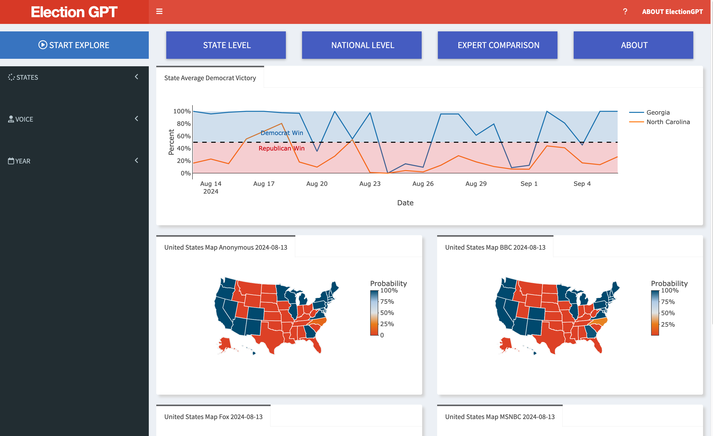

# ElectionGPT

ElectionGPT is a forecasting experiment designed to predict the outcomes of the 2024 U.S. Presidential Election using narrative-driven predictions with ChatGPT-4o-mini. This project, developed by Scott Cunningham (Baylor University), Jared Black (Baylor University) and Coco Sun (Baylor University), leverages innovative methods to simulate election forecasting through distinct narrative voices.

## Project Overview

The goal of this project is to explore the capabilities of large language models, like ChatGPT-4o-mini, in generating "future narratives" that predict state-by-state election outcomes. This projects builds on previous work by Pham and Cunningham (2024) using ChatGPT-3.5 and ChatGPT-4 to predict cultural and macroeconmoic events using "future narratives", but that earlier work took advantage of the termination date used by OpenAI for training the two large language models.  But, technically, the prediction was still knowlable if OpenAI was somehow privately updating the LLMs with new information despite documentation claiming they werent' . ElectionGPT is an extension in multiple ways.  First it is predicting in real time a near future event that has not happened -- the 2024 Presidential Election.  Second, it is summarizing 100 stories every day and using those stories in combination with the LLM's training data to announce the future winner in four distinct voices: an unnamed "trustworthy reporter" from an unnamed media company, Brett Baier from Fox News, Rachel Maddow from MSNBC and Laura Kuenssberg from the BBC.  Each prompt is repeated 100 times to get a distribution of announcements of the winner from which we calculate the share of the time Kamala Harris or Donald Trump won.  These results can then be compared to expert forecasters like Nate Silver (https://www.natesilver.net/p/nate-silver-2024-president-election-polls-model), as well as the Economist (https://www.economist.com/interactive/us-2024-election/prediction-model/president). 

## Methodology

The project employs a multi-step process:

1. Data Collection: Each day, 100 news stories related to the 2024 U.S. Presidential Election are retrieved using the Event Registry API. This approach ensures that the data is "endogenous" and not manually curated, allowing for a dynamic and unbiased selection of news sources.  This step does not involve a large langauge model (LLM).

2. Narrative Generation: Using the retrieved news stories, ChatGPT-4o-mini generates election result stories from the perspective of four distinct voices:
   - Direct Reporting: An anonymous, trustworthy reporter providing a "summary" news story on the election outcome.
   - Fox News Reporter (Bret Baier)
   - MSNBC Reporter (Rachel Maddow)
   - BBC Reporter (Laura Kuenssberg)

   Each voice narrates the outcome of the 2024 election, creating a total of 400 stories daily (100 stories per voice).

3. Data Extraction: ChatGPT-3.5 Turbo is used to extract the winners of each state from the generated stories and store them in a matrix format. The matrix is updated daily, capturing state outcomes by distinct voice over time.

4. Data Analysis: The results are analyzed to identify patterns and deviations in predicted outcomes, exploring how different narrative voices might influence or predict election results.

## Objectives

- To assess the potential of narrative-driven predictions using AI models.
- To understand how different narrative voices, informed by distinct media biases, influence election outcome predictions.
- To build a dynamic dataset that tracks state outcomes over time and provides insights into model performance and potential biases.

## Results and Visualizations

The project will present two main types of visualizations:

1. National Time Series Plot: This plot shows the projected Democratic win as the percentage of trials each day where Kamala Harris secures enough electoral college votes to become President.

2. Map of the United States: A visual representation of daily changes in state predictions across the four distinct voices, helping to interpret variations and understand potential causes.

## Shiny App 

For more informaton about the project, please visit our shiny app.

https://pregptdiction.shinyapps.io/ElectionGPT/

## References

Pham (r) and Cunningham (r) (2024), "Can BaseGPT be Used for Forecasting without Additional Optimizatoin?" https://arxiv.org/abs/2404.07396

## Get Involved

We welcome feedback and collaboration from the community. If you're interested in contributing to the project or have suggestions, please feel free to open an **Issue** or submit a **Pull Request** on our GitHub repository.

## License

This project is licensed under the MIT License - see the [LICENSE](LICENSE) file for details.

## Acknowledgments

Special thanks to Jared Black and Coco Sun for their tireless work on this project. We also appreciate the valuable input from our readers and colleagues.

